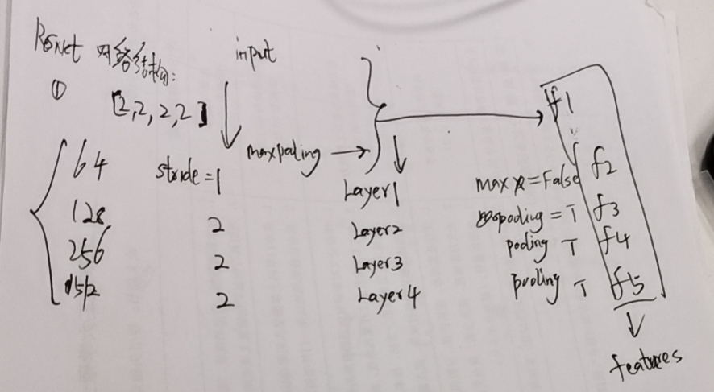

<!--
 * @Author: your name
 * @Date: 2019-12-23 22:57:00
 * @LastEditTime : 2019-12-26 21:47:14
 * @LastEditors  : Please set LastEditors
 * @Description: In User Settings Edit
 * @FilePath: \monodepth2\coderead\train.md
 -->

 # 1 现在遇到的问题是：
    1. 要解决数据集，文章中使用的数据集是kitti2015 ，直接从文章中的链接中下载
    2. 初始化：
      1. 训练分为三个步骤
         monocloar单视训练
      2. 立体训练
      3. 立体+单目训练
      
=======
 现在遇到的问题是：
 ---
 
1. 要解决数据集，文章中使用的数据集是kitti2015 ，直接从 文章中的链接中下载
2. 编码器和解码器分别是不同的两个独立的网络
    - 网络结构是什么
    - 网络结构存储在一个{}中
    1. self.models["encoder"] = networks.ResnetEncoder
    2. self.models["depth"]=networks.DepthDecoder
    3.  @ use_stereo = 1 stero and mix training
        @ frame_ids = 0  if stero or  monocolor else [-1, 1 ,0] 
        @ monocolor trianing => use_pose_net = 1
          当monocolor 训练时，use_pose_net==1
          使用独立的网络 opt.pose_model_type == "separate_resnet":
          self.models["pose_encoder"]=networks.ResnetEncoder
          self.models["pose"] = networks.PoseDecoder
        @ 当opt.pose_model_type == "shared"
            self.models["pose"] = networks.PoseDecoder 
            self.models["pose_encoder"] = self.models["encoder"]两个网络共享
    网络结构共享
    

3. 什么是自监督学习？
---
    @ 字典的关键字居然可以是列表
    @ 使用自监督学习方法与目标检测模型进行权重共享训练
    @ np中的deepcopy 为np.copy浅拷贝就是 a = b 创建引用
    @ dict 字典也可以受用for 而不是使用 items 
        for key in list(dict):
            print(key)
        打印输出的是关键字
    @ 以后resize 图形可以使用skimage 包进行转换
    @ 使用numpy 对图像进行翻转
    @ i in frame_ids 
    @ dataloader 生成的输入
        inputs[("color", i, scale])] i =frame_ids
        inputs[("color__aug", i, scale)]#scale = [0,1,2,3]
        inputs[("K", scale)] #scale = [0,1,2,3]
        inputs[("inv_K", scale)]
        inputs["depth_gt"] #如果 .bin 文件存在 加载深度图
        inputs["stereo_T"] = +-1 # if 's' in frame_id
    @ 那么label从何而来？
    label就是其对应的 depth_gt
---

4. 共享编码器姿态估计网络推理过程
- all_features = self.models["encoder"](all_color_aug)
- networks.ResnetEncoder(
            self.opt.num_layers, self.opt.weights_init == "pretrained")
     @ 初始化时为num_layers ==18，weights_init = "pretrained"
     resnet 的网络结构
        x = self.conv1(x)
        x = self.bn1(x)
        x = self.relu(x)
        x = self.maxpool(x)

        x = self.layer1(x)
        x = self.layer2(x)
        x = self.layer3(x)
        x = self.layer4(x)

        x = self.avgpool(x)
        x = torch.flatten(x, 1)
        x = self.fc(x)
    

    这个网络实际上使用的与u型网络同样的结构，只不过为了共享网络，进行了编解码器的分离
使用单模态训练，使用3张图进行深度估计训练，帧的id分别时[-1,0,1]

    predict_poses 运动路径估计
    输入 inputs, features (encoder 输出的特征)

